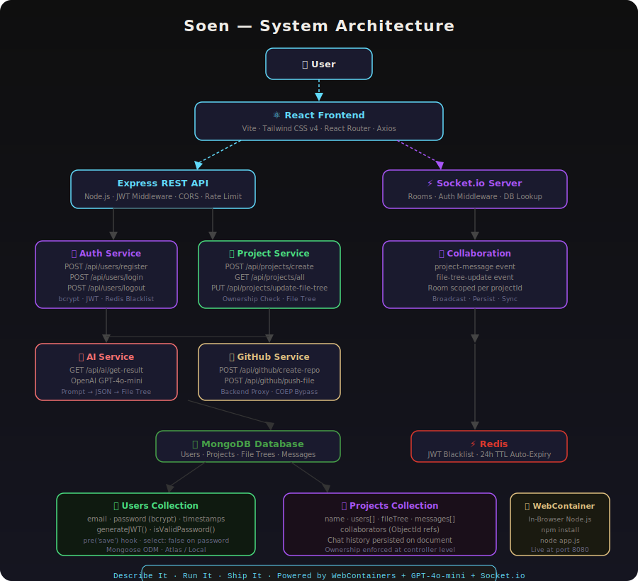

<div align="center">


# 🤖 Soen

### AI Code Generation · Real-Time Collaboration · In-Browser Execution · GitHub Push

A full-stack AI-powered collaborative coding platform — describe what you want to build, and Soen generates a complete, runnable application instantly inside your browser.

</div>

---

## 🚀 Demo

> Coming Soon

---

## 📌 Problem Statement

Most developers waste hours on project scaffolding, boilerplate setup, and environment configuration before writing a single line of business logic.

Soen eliminates that friction:

- 🤖 How can an AI generate a complete, working application from a single prompt?
- 🌐 How can code run instantly in a browser without any local setup?
- 👥 How can multiple developers collaborate on the same codebase in real time?
- 🚀 How can the generated code be pushed directly to GitHub in one click?

---

## 📊 Project Highlights

- Full-Stack AI Code Generation Platform
- Real-Time Collaboration via Socket.io
- In-Browser Node.js Runtime via WebContainer
- Persistent Chat History across page refreshes
- JWT Authentication with Redis Token Blacklisting
- GitHub Repository Integration with one-click push
- Three-Tier Rate Limiting — DDoS, brute force, AI cost protection
- Project Ownership — only members can access project data

---

## 💡 Core Concept — Describe It, Run It, Ship It

Soen follows a three-step workflow:

```
1. Describe   →  @ai create a todo app with express backend
2. Run        →  AI generates files → WebContainer boots → App runs in browser
3. Ship       →  Push to GitHub with one click
```

Every project is a live, collaborative workspace. Multiple users can join the same project, chat in real time, and see file changes reflected instantly — no page refresh needed.

---

## 🏗️ System Architecture




---

## ⚙️ AI Generation Pipeline

1. User submits an `@ai` prompt
2. Backend extracts the prompt
3. Existing project file context is injected
4. GPT-4o-mini generates structured JSON
5. Response is validated — invalid JSON is rejected
6. Files are written to the WebContainer
7. Changes are persisted to MongoDB
8. Socket.io broadcasts updates to all collaborators
9. Project boots automatically — `npm install` → `node app.js`
10. Live Preview updates instantly

---

## 🤝 Real-Time Collaboration Flow

```
User A joins project   →  Socket connects to room (projectId)
User A types message   →  Socket broadcasts to all in room
User B edits a file    →  file-tree-update event → all clients sync
@ai prompt sent        →  AI response broadcast to entire room
Page refresh           →  Messages + file tree restored from MongoDB
```

Every message and file state is persisted to MongoDB — collaborators who join late or refresh the page see the full history instantly.

---

## 🔐 Authentication

- Passwords hashed with **bcrypt** via Mongoose `pre('save')` hook
- Login returns a **JWT** (24h expiry) stored in HTTP cookie and localStorage
- On logout, token is added to **Redis blacklist** with 24h TTL — auto-expires, no cleanup needed
- Every protected route and socket connection checks the blacklist before trusting a token
- Socket auth middleware does full DB lookup — `socket.user` is always the complete user document

---

## 🛡️ Rate Limiting

Three-tier rate limiting protects the API from abuse:

| Limiter | Routes | Window | Max | Protects |
|---------|--------|--------|-----|----------|
| Global | All routes | 15 min | 100 requests | DDoS attacks |
| Auth | `/register`, `/login` | 15 min | 10 attempts | Brute force |
| AI | `/api/ai/*` | 1 hour | 20 requests | OpenAI cost explosion |

---

## 🐙 GitHub Push

Generated code can be pushed directly to a GitHub repository in one click:

```
1. User clicks "Push to GitHub"
2. GitHub token + repo name entered
3. Backend proxies GitHub API — avoids COEP browser restrictions
4. Repository created on GitHub
5. Each file base64 encoded → pushed individually
6. Repo URL returned → clickable link shown in UI
```

> GitHub API calls are proxied through the backend because the `Cross-Origin-Embedder-Policy: require-corp` header — required by WebContainer — blocks direct browser-to-GitHub API requests.

---

## ✨ Features

| Feature | Description |
|---|---|
| 🔐 JWT Authentication | Login, register, logout with Redis token blacklist |
| 👥 Real-Time Collaboration | Multiple users on the same project via Socket.io |
| 🤖 AI Code Generation | Describe your app — GPT-4o-mini generates complete file trees |
| 🌐 In-Browser Execution | WebContainer runs Node.js apps directly in the browser |
| 💬 Persistent Chat | Messages survive page refresh — stored in MongoDB |
| 🔄 Live File Sync | File edits broadcast instantly to all collaborators |
| 📁 File Explorer | Browse and edit AI-generated files |
| 🖥️ Integrated Terminal | See npm install and server logs in real time |
| 👁️ Live Preview | Running app renders in an inline iframe |
| 🐙 GitHub Push | Push generated code to a new GitHub repo in one click |
| 🛡️ Rate Limiting | Three-tier protection — global, auth, and AI limits |
| 🔒 Project Ownership | Only project members can access project data |

---

## 🎯 Engineering Concepts Demonstrated

| Concept | Implementation |
|---|---|
| **Real-Time Communication** | Socket.io rooms scoped per project — messages and file updates broadcast only to collaborators in the same project |
| **In-Browser Node.js** | WebContainer API boots a full Node.js runtime in the browser — no server, no Docker, no local setup needed |
| **AI-Driven Code Generation** | GPT-4o-mini receives existing file context + user prompt — generates complete, structured JSON with file tree, build command, and start command |
| **JWT Authentication & Token Revocation** | Logout adds token to Redis with TTL matching JWT expiry — blacklisted tokens auto-expire, no cron job needed |
| **Backend GitHub Proxy** | Cross-Origin-Embedder-Policy blocks browser-to-GitHub API calls — all GitHub operations proxied through Express to work around this constraint |
| **Chat History Persistence** | Messages stored in MongoDB on the project document — collaborators who join late or refresh get full chat history instantly |
| **Socket Auth with DB Lookup** | Socket middleware does full `userModel.findById()` — `socket.user` is always a complete document, never a stale JWT payload |
| **Three-Tier Rate Limiting** | Global DDoS protection + strict auth limits + per-hour AI limits — prevents brute force attacks and OpenAI cost explosion |

---

## 📁 Project Structure

```
soen/
│
├── README.md
│
├── backend/
│   ├── server.js                         # http server + Socket.io setup
│   └── src/
│       ├── app.js                        # express app + rate limiting
│       ├── config/
│       │   └── db.js                     # MongoDB connection
│       ├── controllers/
│       │   ├── user.controller.js        # register, login, logout, profile
│       │   ├── project.controller.js     # CRUD + ownership check
│       │   ├── ai.controller.js          # prompt validation + AI call
│       │   └── github.controller.js      # GitHub API proxy
│       ├── middleware/
│       │   ├── auth.middleware.js        # JWT + Redis blacklist + DB lookup
│       │   └── rateLimiter.js            # global, auth, AI limiters
│       ├── models/
│       │   ├── user.model.js             # bcrypt pre-save hook + generateJWT
│       │   └── project.model.js          # fileTree + messages + collaborators
│       ├── routes/
│       │   ├── user.routes.js            # auth routes + rate limit
│       │   ├── project.routes.js         # project CRUD routes
│       │   ├── ai.routes.js              # AI route + rate limit
│       │   └── github.routes.js          # GitHub proxy routes
│       └── services/
│           ├── ai.service.js             # OpenAI GPT-4o-mini integration
│           ├── project.service.js        # project business logic
│           ├── user.service.js           # user business logic
│           └── redis.service.js          # Redis client
│
└── frontend/
    ├── index.html
    ├── vite.config.js                    # COEP/COOP headers + WebContainer
    └── src/
        ├── api/
        │   ├── axios.js                  # interceptor — auto-attach JWT
        │   ├── user.api.js
        │   ├── project.api.js
        │   ├── ai.api.js
        │   └── github.api.js
        ├── components/
        │   ├── ChatSection.jsx           # real-time chat UI
        │   ├── CodeEditor.jsx            # file editor + run button
        │   ├── FileExplorer.jsx          # file tree browser
        │   ├── Terminal.jsx              # npm + server output
        │   ├── Preview.jsx               # iframe live preview
        │   ├── SidePanel.jsx             # collaborators list
        │   ├── CollaboratorsModal.jsx    # add collaborator
        │   ├── GitHubPushModal.jsx       # GitHub push form
        │   └── SyntaxHighlightedCode.jsx # AI message code blocks
        ├── config/
        │   ├── socket.js                 # Socket.io client singleton
        │   └── webContainer.js           # WebContainer boot singleton
        ├── context/
        │   └── user.context.jsx          # auth state + localStorage persistence
        ├── hooks/
        │   ├── useAuth.js                # login, register, logout
        │   ├── useProject.js             # project CRUD + file tree
        │   └── useGitHub.js              # GitHub push via backend proxy
        ├── routes/
        │   └── AppRoutes.jsx             # ProtectedRoute + PublicRoute
        └── screens/
            ├── Login.jsx
            ├── Register.jsx
            ├── Home.jsx                  # projects list + create
            └── Project.jsx               # main workspace
```

---

## 🧠 Tech Stack

| Layer | Technology | Purpose |
|---|---|---|
| Frontend | React + Vite | UI framework |
| Styling | Tailwind CSS v4 | Utility-first styling |
| Routing | React Router v6 | Client-side navigation |
| API Client | Axios | HTTP requests + JWT interceptor |
| State | React Context API | Auth state — no Redux needed |
| Real-Time | Socket.io | Bi-directional event communication |
| In-Browser Runtime | WebContainer API | Node.js in the browser |
| Backend | Node.js + Express | REST API + Socket.io server |
| Database | MongoDB + Mongoose | Document store + ODM |
| Cache / Blacklist | Redis + ioredis | JWT token blacklist with TTL |
| Auth | JWT + bcrypt | Token auth + password hashing |
| AI | OpenAI GPT-4o-mini | Code generation |
| Rate Limiting | express-rate-limit | DDoS + brute force protection |
| GitHub Integration | GitHub REST API | Repo creation + file push |

---

## 🚀 Getting Started

### Prerequisites

- Node.js 18+
- MongoDB running locally or MongoDB Atlas URI
- Redis running locally or Redis Cloud URI
- OpenAI API key

### 1. Clone the repository

```bash
git clone https://github.com/Sushpal/soen.git
cd soen
```

### 2. Backend setup

```bash
cd backend
npm install
```

Create `.env`:

```env
MONGO_URI=your_mongodb_connection_string
JWT_SECRET=your_jwt_secret
REDIS_HOST=your_redis_host
REDIS_PORT=your_redis_port
REDIS_PASSWORD=your_redis_password
OPENAI_API_KEY=your_openai_api_key
PORT=3000
```

Start backend:

```bash
npm run dev
```

### 3. Frontend setup

```bash
cd frontend
npm install
```

Create `.env`:

```env
VITE_API_URL=http://localhost:3000
```

Start frontend:

```bash
npm run dev
```

Open `http://localhost:5173` 🎉

---

## ☁️ Deployment

| Layer | Platform |
|---|---|
| Frontend | Vercel |
| Backend | Render |
| Database | MongoDB Atlas |
| Redis | Redis Cloud |
| AI | OpenAI API |

---

## 🗺️ Roadmap

- File and folder create / delete in editor
- Multi-file tab management
- Project templates — choose a starter instead of blank canvas
- Shareable project links
- Docker deployment
- Mobile responsive layout

---

## 👨‍💻 Author

**Sushpal**

Built to explore AI-driven development, real-time collaboration, and in-browser code execution — combining WebContainers, Socket.io, and GPT-4o-mini into a single cohesive platform.

- GitHub: https://github.com/Sushpal
- Email: nenavathsushpal4@gmail.com

---

<div align="center">

### 🤖 Soen — Describe It. Run It. Ship It.

<sub>Built with React · Node.js · Express · MongoDB · Socket.io · WebContainers · OpenAI · Redis</sub>

</div>